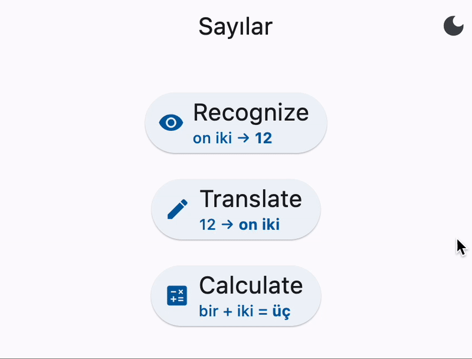

# Sayılar

*Sayılar* (Turkish for "numbers") is an app with simple exercises for practicing
Turkish numbers.



## About

This app has different simple exercises for practicing recognizing and using
Turkish numbers.
It aims to be as minimal as possible, as it is only a little side project.
It arose from myself learning Turkish and wanting a better way of practicing
their numbers.

There are still a few improvements and new exercises planned (see the
[issues](https://github.com/JimGerth/sayilar-flutter/issues)) and eventually
this app is planned to be available for download, although there is no timeline
for that.


## Exercises

There are three exercises currently available.

### Recognize

For this exercise, the user is presented with a number written out in Turkish
(e.g. _"on iki"_), which they have to recognize and understand to answer with
the correct numerical value (e.g. _12_).

### Translate

In effect, this exercise is the opposite of the previous one.
Here, the user is presented with a numerical value (e.g. _12_), which they have
to translate into and write out in Turkish (e.g. _"on iki"_).

### Calculate

For this exercise, the user is presented with with two numbers written out in
Turkish and combined with a mathematical opertaion (e.g. _"bir + iki"_).
Firstly, the user has to recognize each number to get their respective numerical
values in order to be able to perform the calculation (e.g. _1 + 2 = 3_).
Secondly, the user has to translate and write out the answer to the calculation
in Turkish (e.g. _"üç"_).
Thus, this is a combination of the first two exercises, as both recognizing and
translating are trained.


## Run

You need to have
[`flutter` installed](https://docs.flutter.dev/get-started/install)
to run this app by doing
```sh
git clone https://github.com/JimGerth/sayilar-flutter.git
cd sayilar-flutter
flutter run
```
